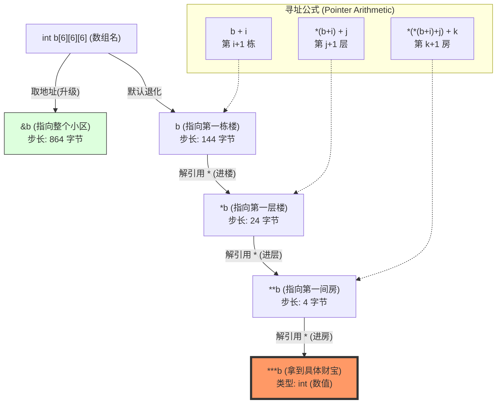

“大楼”模型，我们直接进阶到三维数组 `int b[6][6][6]`。

在这个模型中：

* **整个小区**：`b`
* **大楼 (Block/Building)**：第一维，索引 `i`
* **楼层 (Floor)**：第二维，索引 `j`
* **房间 (Room)**：第三维，索引 `k`

---

## 三维数组 `int b[6][6][6]` 指针运算解析

假设 `int` 占 4 字节，首地址为 `0x2000`。

| 序号 | 表达式 | 类型 (Type) | 偏移量单位 (Stride) | 比喻 (Analogy) |
| --- | --- | --- | --- | --- |
| 1 | `b` | `int (*)[6][6]` | 1 栋楼 ( 字节) | 站在**小区门口**，看向第 1 栋楼 |
| 2 | `*b` | `int (*)[6]` | 1 层楼 ( 字节) | 进入第 1 栋楼，站在**第 1 层**门口 |
| 3 | `**b` | `int *` | 1 个房间 (4 字节) | 进入第 1 层，站在**第 1 间房**门口 |
| 4 | `***b` | `int` | N/A (取值) | 敲开第 1 栋 1 层 1 号房，**拿到里面的东西** |
| 5 | `b + 1` | `int (*)[6][6]` | 144 字节 | 走到**第 2 栋楼**的大门口 |
| 6 | `*(b + 2) + 3` | `int (*)[6]` | 24 字节 | 走到**第 3 栋楼**的**第 4 层**门口 |
| 7 | `*(*(b + 2) + 3) + 4` | `int *` | 4 字节 | 走到第 3 栋楼、第 4 层的**第 5 间房**门口 |
| 8 | `&b + 1` | `int (*)[6][6][6]` | 整个小区 ( 字节) | 离开这个小区，去**隔壁小区**的大门 |
| 9 | `*(&b + 1) - 1` | `int (*)[6][6]` | 144 字节 | 从隔壁小区往回退 1 栋楼（到**最后一栋楼**） |
| 10 | `*(*(&b + 1) - 1) - 2` | `int (*)[6]` | 24 字节 | 在最后一栋楼里，往回退 2 层（到**倒数第 3 层**） |

---

### 关键点拨：理解“降级” (Decay)

在 C 语言中，每增加一个 `*`（解引用）或者 `[]`（下标），指针的“视界”就会缩小一级：

1. `b` 看到的是**楼**（Building）。
2. `*b` 看到的是**层**（Floor）。
3. `**b` 看到的是**房**（Room）。
4. `***b` 看到的是**人/物**（Value）。

这种嵌套关系在 `C Primer Plus` 中被称为**多维数组与指针的等价性**：
`b[i][j][k]` 实际上就是 `*(*(*(b + i) + j) + k)`。

---

